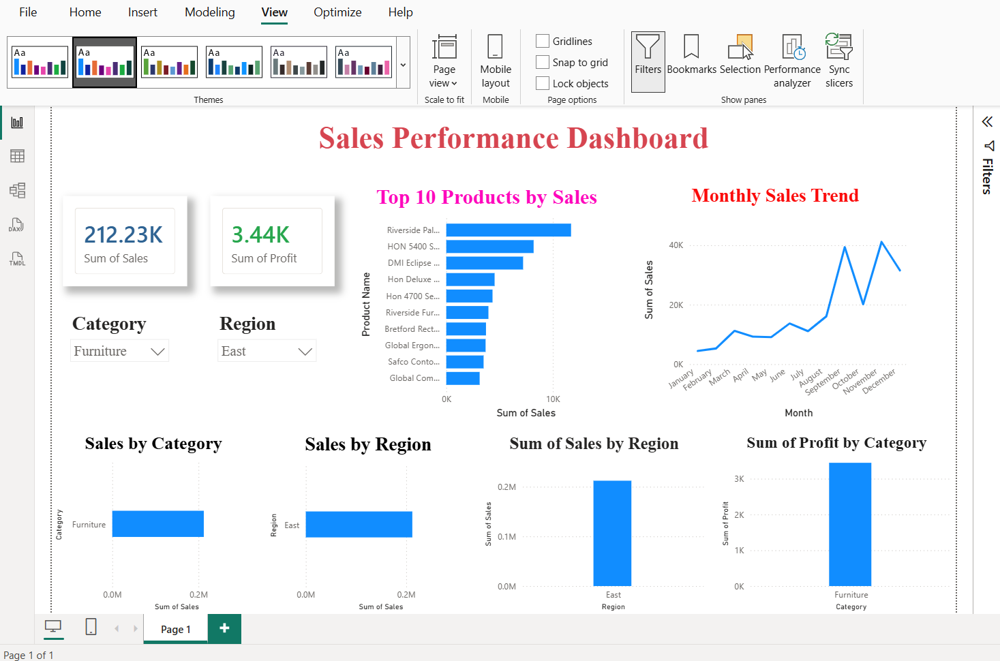
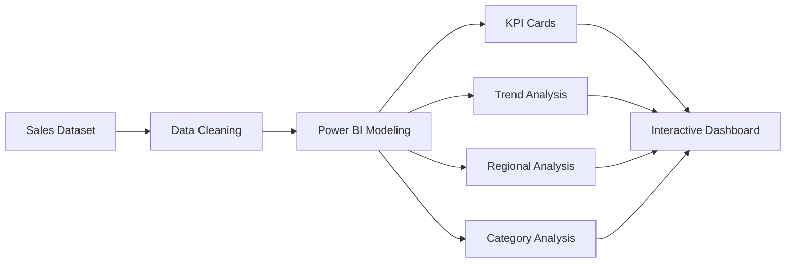

<div align="center">

# 📊 Sales Performance Dashboard


<br>


### 📈 Interactive Dashboard for Analyzing Sales and Profit Performance

</div>

---

# 📌 Overview

This project is a **Power BI Sales Performance Dashboard** built to visualize sales and profit metrics through interactive charts and filters. The dashboard enables users to analyze sales trends, top-performing products, category-wise performance, and regional sales distribution.

---

# ✨ Dashboard Features

✅ Total Sales KPI Card (**212.23K**)

✅ Total Profit KPI Card (**3.44K**)

✅ Top 10 Products by Sales

✅ Monthly Sales Trend Analysis

✅ Category Filter

✅ Region Filter

✅ Sales by Category

✅ Sales by Region

✅ Sum of Sales by Region

✅ Profit by Category

---

# 🛠️ Tools Used

* 📊 Microsoft Power BI
* 📈 Data Visualization
* 📋 Dashboard Design
* 📑 Interactive Filters and Slicers

---

# 📸 Dashboard Preview

<div align="center">



</div>

---

# 📊 Visualizations Included

### 🔹 KPI Cards

* Sum of Sales
* Sum of Profit

### 🔹 Charts

* Top 10 Products by Sales
* Monthly Sales Trend
* Sales by Category
* Sales by Region
* Regional Sales Distribution
* Profit by Category

### 🔹 Filters

* Category
* Region

---

# 📂 Project Structure

```text
Salesperformance
│
├── Sales_Performance_Dashboard.pbix
├── assets
│   └── dashboard.png
├── README.md
```

---

# 🚀 Getting Started

### Clone the Repository

```bash
git clone https://github.com/Abi-1429/Salesperformance.git
```

### Open the Dashboard

1. Install **Microsoft Power BI Desktop**
2. Open:

```text
Sales_Performance_Dashboard.pbix
```

---

# 📈 Dashboard Workflow



---

# 👩‍💻 Author

<div align="center">

# 🌸 M ABIRAMI

### Data Analytics Enthusiast | Power BI Developer

<a href="https://github.com/Abi-1429">

</a>

</div>

---

<div align="center">

⭐ If you found this project useful, consider giving it a star!

Made with ❤️ by **M ABIRAMI**

</div>
